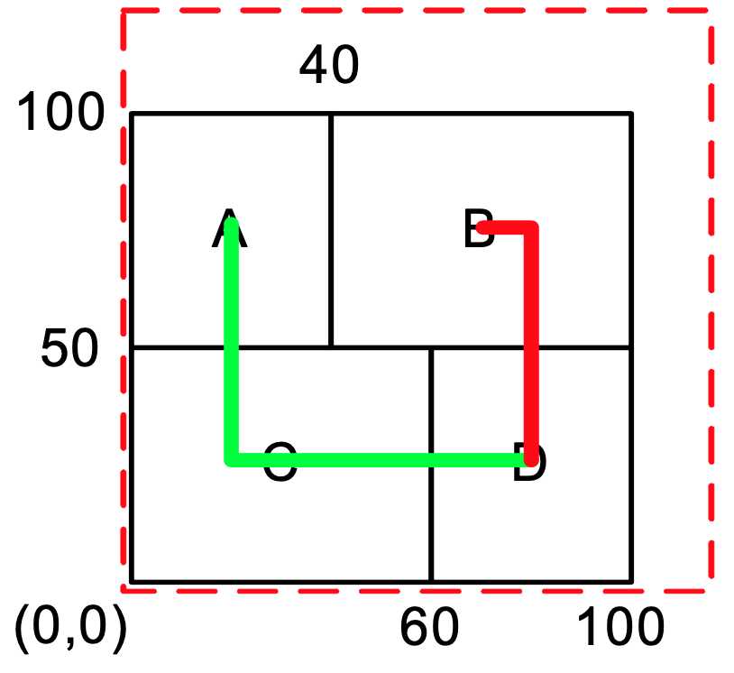

# Fixed-outline Floorplanning


## What is this about?
This is a program assianment of ECE5960-Physical-Design-Algorithm.
The purpose of this assignment is to implement fixed-outline floorplanning
and vefity the correctness using eight benchmarks.
Refer to [Problem Statement](https://github.com/cheng-hsiang-chiu/ECE5960-Physical-Design-Algorithm/blob/master/PA2/README.md#problem-statement),
[Input Format](https://github.com/cheng-hsiang-chiu/ECE5960-Physical-Design-Algorithm/blob/master/PA1/README.md#input-format) and [Output Format](https://github.com/cheng-hsiang-chiu/ECE5960-Physical-Design-Algorithm/blob/master/PA1/README.md#output-format)
for more information.

## Problem Statement
This programming assignment asks you to write a fixed-outline chip floorplanner that can handle hard macros. Given a set of rectangular macros and a set of nets, the floorplanner places all macros within a rectangular chip without any overlaps. We assume that the lower-left corner of this chip is the origin (0,0), and no space (channel) is needed between two different macros. The objective is to minimize the area of chip bounding box and the total net wirelength. The total wirelength $W$ of a set of nets $N$ can be computed by:

$$
W = \sum_{n_i \in N} HPWL(n\_i)
$$

where HPWL denotes the half-perimeter wirelength, i.e., half of bounding box length, of net $n_i$. The objective for this problem is to minimize:

$$
Cost = \alpha A/A_{norm} + (1 - \alpha) W/W_{norm}
$$

where $A$ denotes the bounding-box area of the floorplan, Anorm is the average area, $W$ is the total wire length, Wnorm is the average wire length, and $\alpha$, $0 ≦ \alpha ≦ 1$, is a user defined ratio to balance the final area and wirelength. To compute $A_{norm}$ and $W_{norm}$, we can perturb the initial solution $m$ times to obtain $m$ floorplans and compute the average area $A_{norm}$ and the average wire length $W_{norm}$ of these floorplans. The value $m$ is proportional to the problem size. 

Note that a floorplan which cannot fit into the given outline is not acceptable.

## Input Format

Each test case has two input files, input.block and input.nets. The first file (input.block) gives the outline size, the number of blocks, and the number of terminals defined in this file. Then the block dimensions are listed, followed by the terminal locations. The file format is as follows:

```text
Outline: <outline width, outline height> 
NumBlocks: <# of blocks> 
NumTerminals: <# of terminals>
<macro name> <macro width> <macro height> 
... More macros
<terminal name> terminal <terminal x coordinate> <terminal y coordinate> 
... More terminals
```

The second file gives the number of nets in the floorplan, followed by the terminal information for each net. The file format is as follows:

```text
NumNets: <# of nets>
NetDegree: <# of terminals in this net> <terminal name>
... More terminal names
... More “NetDegree” and “terminal name”
```

The user-defined ratio α is given through the command-line argument. It ranges between 0 and 1.

## Output Format

The output file (output.rpt) records the problem output. This report consists of six parts: 
  1. The final cost
  2. The total wirelength
  3. The chip area
  4. The chip width and height
  5. The runtime in seconds
  6. The bounding-box coordinate for each macro (specified by the lower-left corner and upper-right corner). 

The report file format is shown below:


```text
<final cost>                     // Cost 
<total wirelength>               // W
<chip_area>                      // area = (chip_width) * (chip_height)
<chip_width> <chip_height>       //resulting chip width and height
<program_runtime>                //report the runtime in seconds
<macro_name> <x1> <y1> <x2> <y2> 
<macro_name> <x1> <y1> <x2> <y2> // (x1, y1): lower-left corner, (x2, y2): upper-right corner 
... More macros
```

## Example

Consider the following example of four blocks (`A`, `B`, `C`, and `D`) and two nets (`A, C, D` and `B, D`):

```text
# input.block
Outline: 120 120 
NumBlocks: 4 
NumTerminals: 0 
A 40 50
B 60 50 
C 60 50 
D 40 50
```

```text
# input.nets
NumNets: 2 
NetDegree: 3 
A
C
D 
NetDegree: 2 
B
D
```

An example floorplan output is as follows:

```
5085 
170 
10000 
100 100 
0.24
A 0 50 40 100 
B 40 50 100 100 
C 0 0 60 50 
D 60 0 100 50
```




## Repository structure
- src : source code
- benchmark : eight benchmarks
- unittest : unit test
- 3rd-party : third party library for unit test usage only
- paper : papers
- CMakeLists.txt : cmake file
- checker_linux : correctness checking
- run.sh : a script to run the executable, measure runtime and verify the results for all benchmarks
- PA1-report.pdf : a report
- images : an illustration

## Build
To build the executable, please follow the instructions below. The default compiler is clang++.
```
mkdir build
cd build
cmake ../
make
```

## Run
To run the executable, please follow the instructions below.
Change the input files and output files according to your needs.
```
cd build
```

## Unit Test
To run the unit tests, please follow the instructions below.
```
cd build
make test
```

## Verify correctness
To verify the correctness of the executable, please follow the instructions below.
Modify the input files and output files according to your needs.
```
cd build
```

## Run the script
Instead of running the executable for the benchmark one by one,
the `run.sh` is used to run the executable, measure the runtime and verify the results for all benchmarks.
The script will be copied to the folder `build` when building the executable.
```
cd build
chmod 744 ./run.sh
./run.sh
```


## Reference
